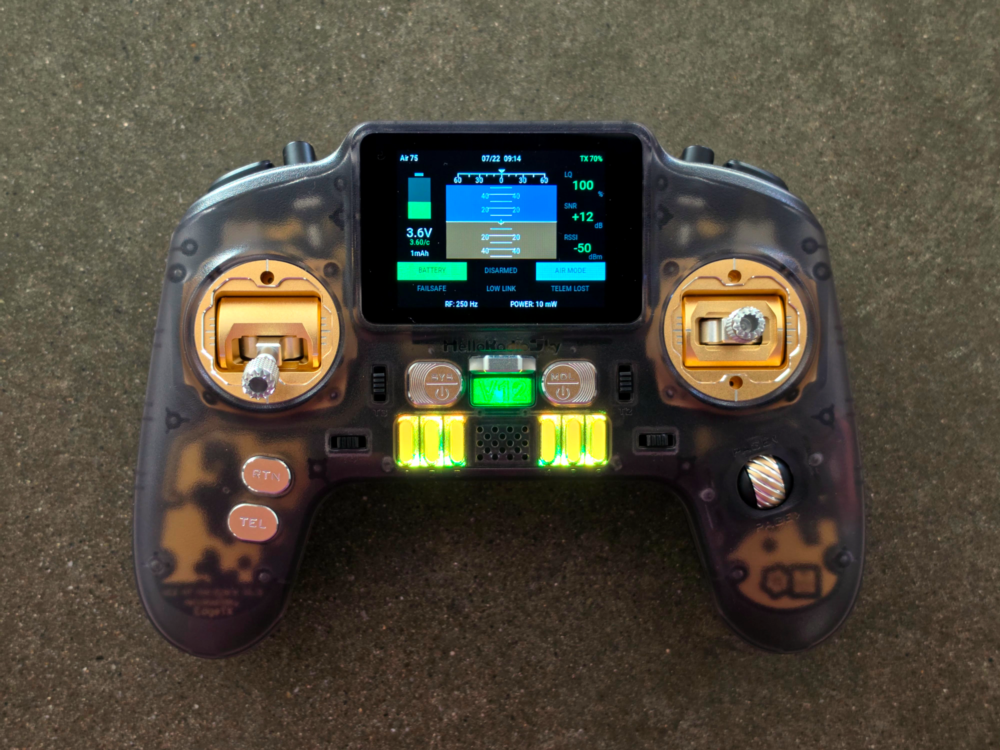
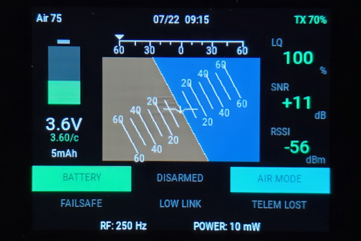
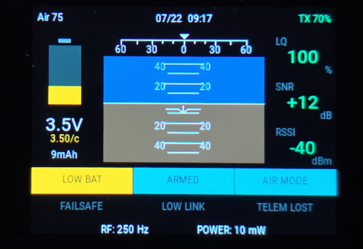
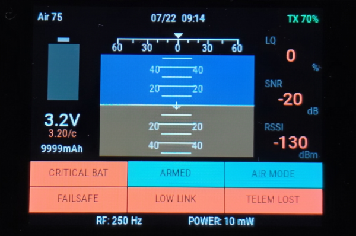

# V12 Flight Test Widget

V12FlightTest is a compact flight-test telemetry dashboard widget for 320 × 240 EdgeTX color radios. It was designed around the HelloRadio V12, Betaflight, and ExpressLRS/CRSF telemetry. The display probably has more information than neccessary, however it looks cool!

## Example Screenshots

## Lamp Test

## Features

- Full-roll artificial horizon with sky and ground fill
- Pitch tracking through steep nose-up, nose-down, and inverted attitudes
- ±60° pitch ladder with clean 10° spacing
- Moving bank-angle scale with roll pointer
- Pitch, roll, and computed yaw-rate display
- Flight battery voltage, per-cell voltage, current, and consumed capacity
- Adaptive ExpressLRS signal quality coloring based on RF packet rate
- Link Quality, RSSI, SNR, RF rate, and transmit power display
- Color-coded battery, link, and telemetry status annunciators
- ARMED / DISARMED and flight mode annunciators
- Configurable Lamp Test switch for pre-flight display verification
- Color-coded transmitter battery percentage
- Optional battery-only audio alerts

## Requirements

- EdgeTX color radio with a 320 × 240 display
- Betaflight attitude and battery telemetry over CRSF
- ExpressLRS or another CRSF telemetry link
- EdgeTX English sound pack for the optional `lowbat.wav` voice prompt

The critical battery alarm does not depend on a voice file. It uses a repeating four-pulse tone even when `critbat.wav` is absent.

## Installation

1. Extract the ZIP archive.
2. Copy the included `V12FlightTest` folder to the radio SD card:
   `/WIDGETS/V12FlightTest/`
3. Confirm the resulting script path is:
   `/WIDGETS/V12FlightTest/main.lua`
4. Safely eject the radio or SD card.
5. On the radio, open the model display or telemetry-screen setup.
6. Add a widget and select **V12FlightTest**.
7. Use the widget at full-screen size for the intended 320 × 240 layout.

If the widget does not appear, restart EdgeTX or reload the Lua scripts.

## Widget Settings

- **LQWarn** — Link-quality caution threshold, percent
- **LQCrit** — Link-quality critical threshold, percent
- **VWarn** — Low-battery threshold in centivolts per cell (`350` = 3.50 V/cell)
- **VCrit** — Critical-battery threshold in centivolts per cell (`330` = 3.30 V/cell)
- **Cells** — Manual cell count from 1–8; `0` enables automatic detection
- **BatAlarm** — Enables or disables battery warning audio
- **LampTest** — Optional physical or logical switch used to illuminate all warnings and display simulated critical telemetry values

## Lamp Test

Assign any physical or logical switch to the **LampTest** widget option.

While the assigned switch is active, the widget temporarily displays:

- Critical battery
- Failsafe
- Low link quality
- Telemetry lost
- ARMED
- AIR MODE
- Representative worst-case LQ, RSSI, and SNR values

The lamp test is visual only. It does not modify telemetry or trigger battery audio alarms.

## Battery Alarm Behavior

- Crossing **VWarn** plays the low-battery prompt once, followed by two warning tones.
- Crossing **VCrit** attempts the critical-battery prompt, then plays a four-pulse critical alarm.
- While voltage remains critical, the four-pulse alarm repeats every five seconds.
- The tone alarm still works when the corresponding WAV file is missing.
- Battery warnings are generated only while valid telemetry is being received, preventing false alarms after telemetry loss.
- Disabling **BatAlarm** affects only audio; visual warnings remain active.

## Telemetry Names

The widget checks several common EdgeTX/CRSF sensor names, including `RxBt`, `VFAS`, `Curr`, `Capa`, `RQly`, `1RSS`, `2RSS`, `RSNR`, `RFMD`, `TPWR`, `FM`, `Ptch`, `Roll`, and `Yaw`.

Sensor discovery can vary with EdgeTX, Betaflight, and receiver configuration. Discover new telemetry sensors in EdgeTX after powering the model if values are missing.

## Version

V12FlightTest v1.1

Designed by Lucas Weakley. Development assistance provided by ChatGPT (OpenAI).
