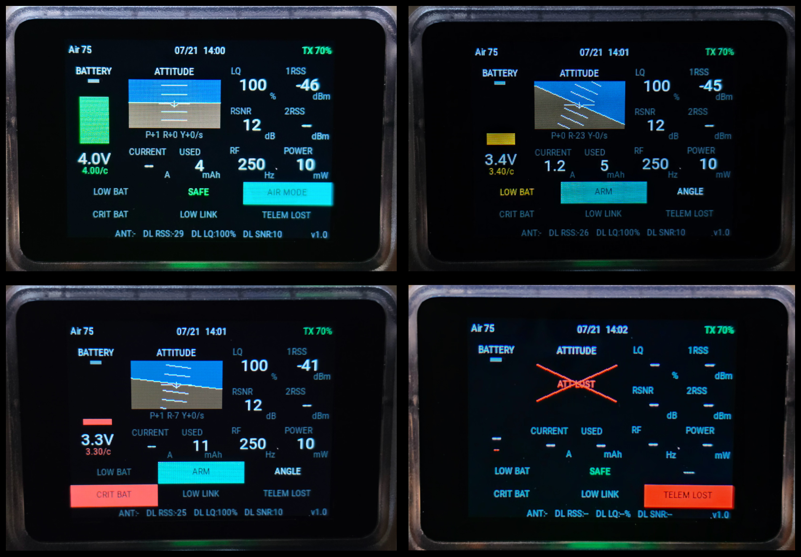

# V12 Flight Test Widget

V12FlightTest is a compact flight-test telemetry dashboard widget for 320 × 240 EdgeTX color radios. It was designed around the HelloRadio V12, Betaflight, and ExpressLRS/CRSF telemetry.

## Features

- Full-roll artificial horizon with sky and ground fill
- Pitch tracking through steep nose-up and nose-down attitudes
- Pitch ladder from −60° to +60° in clean 10° increments
- Pitch, roll, and computed yaw-rate display
- Flight battery voltage, per-cell voltage, current, and consumed capacity
- ExpressLRS link quality, RSSI, SNR, RF rate, power, antenna, and downlink data
- ARM/SAFE and flight-mode annunciators
- Teal advisory styling for ARM and AIR MODE
- Color-coded transmitter battery percentage
- Date and time display
- Optional battery-only audio alerts
- Brief startup identification screen and visible version label

## Requirements

- EdgeTX color radio with a 320 × 240 display
- Betaflight attitude and battery telemetry over CRSF
- ExpressLRS or another CRSF telemetry link
- EdgeTX English sound pack for the optional `lowbat.wav` voice prompt

The critical battery alarm does not depend on a voice file. It uses a repeating four-pulse tone even when `critbat.wav` is absent.

## Installation

1. Extract the ZIP archive.
2. Copy the included `V12FlightTest` folder to the radio SD card:

   `/WIDGETS/V12FlightTest/`

3. Confirm the resulting script path is:

   `/WIDGETS/V12FlightTest/main.lua`

4. Safely eject the radio or SD card.
5. On the radio, open the model display or telemetry-screen setup.
6. Add a widget and select **V12FlightTest**.
7. Use the widget at full-screen size for the intended 320 × 240 layout.

If the widget does not appear, restart EdgeTX or reload the Lua scripts.

## Widget settings

- **LQWarn** — Link-quality caution threshold, percent
- **LQCrit** — Link-quality critical threshold, percent
- **VWarn** — Low-battery threshold in centivolts per cell; `350` means 3.50 V/cell
- **VCrit** — Critical-battery threshold in centivolts per cell; `330` means 3.30 V/cell
- **Cells** — Manual cell count from 1–8; `0` enables automatic detection
- **BatAlarm** — Enables or disables battery warning audio

## Battery alarm behavior

- Crossing **VWarn** plays the low-battery prompt once, followed by two warning tones.
- Crossing **VCrit** attempts the critical-battery prompt, then plays a four-pulse critical alarm.
- While voltage remains critical, the four-pulse alarm repeats every five seconds.
- The tone alarm still works when the corresponding WAV file is missing.
- Disabling **BatAlarm** affects only audio; visual warnings remain active.

## Telemetry names

The widget checks several common EdgeTX/CRSF sensor names, including `RxBt`, `VFAS`, `Curr`, `Capa`, `RQly`, `1RSS`, `2RSS`, `RSNR`, `RFMD`, `TPWR`, `FM`, `Ptch`, `Roll`, and `Yaw`.

Sensor discovery can vary with EdgeTX, Betaflight, and receiver configuration. Discover new telemetry sensors in EdgeTX after powering the model if values are missing.

## Version

V12FlightTest v1.0

Designed by Lucas Weakley with development assistance from ChatGPT by OpenAI.
